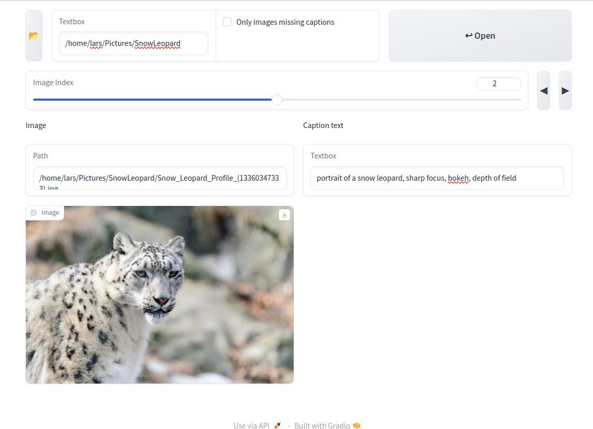

# Simple Image Tagger

A simple image tagger which allows a lean process for tagging images. 
Tags are saved in .txt format whose filename corresponds to the image name. This app is powered by gradio.



## Installation
**Clone repository** 
```
git clone https://github.com/larsupb/ImageTagger
```
**Navigate into installation directory and create venv**
```
cd ImageTagger
python -m venv venv
```
**Activate and setup venv**
```
source venv/bin/activate
pip install -r requirements.txt
```
## Launch instructions
Open a console and navigate to installation directory. 
Run app by executing: 
```
python main.py
```

